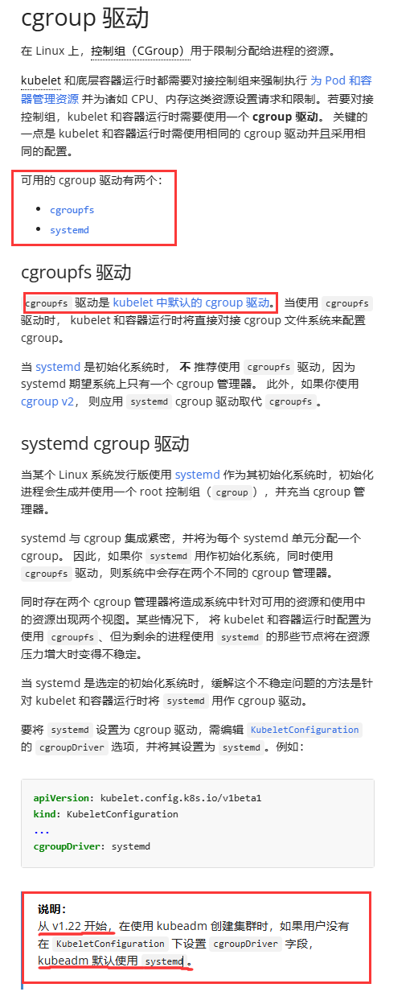
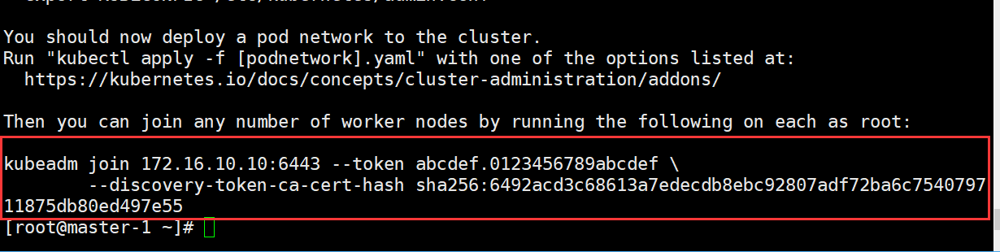
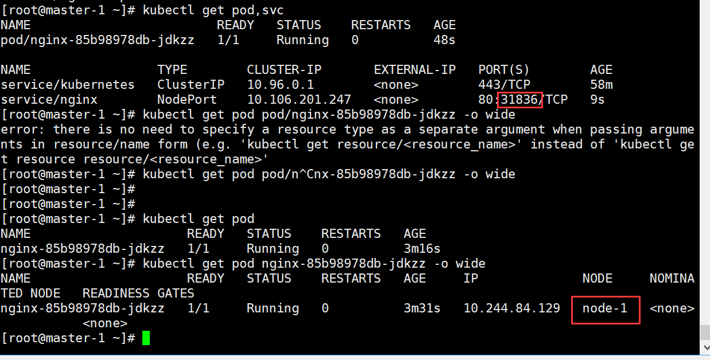
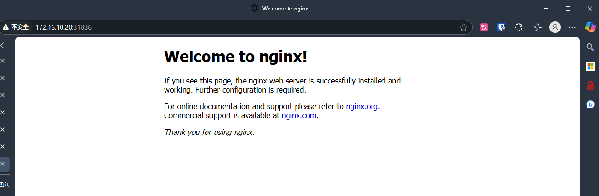

# 基于kubeadm的集群搭建

## 案例分析

使用kubeadm进行Kubernetes v1.23版本集群的快速部署【自k8s集群1.24版本后k8s 不再原生支持Docker Engine,而是使用cri接口进行管理容器运行时管理，为了便于教学这里使用最后一个原生支持Docker Engine的k8s集群进行演示，如若需要基于docker Engine部署24及以上的集群需要再此基础上额外配置kubelet,CRI,cgroup 驱动,部署cri-dockerd】，使用Centos 7系统。  
系统和其他硬件要求如下:   
- 系统Centos 7.9
- Master和Node安装最小需求内存2G，为了保证实验的顺利进行推荐内存为4—8G
- 存储每台节点大于20G
- 网卡两张，一种可以连通外网的网卡，一张内外网卡，用于集群之间的通信

IP规划如下【内网网卡地址如下】  
| IP              | 主机名   | 节点       |
| --------------- | -------- | ---------- |
| 172.16.10.10/24 | Master-1 | Master节点 |
| 172.16.10.20/24 | Node-1   | Node节点   |


## 服务器基础配置 【两台节点同时操作】

### 配置yum源 && 安装必要的软件包

源来自阿里巴巴开源镜像站 【https://developer.aliyun.com/mirror/】

```shell
#配置基本yum源
[root@localhost ~]# rm -rf /etc/yum.repos.d/*
[root@localhost ~]# curl -o /etc/yum.repos.d/CentOS-Base.repo https://mirrors.aliyun.com/repo/Centos-7.repo
[root@localhost ~]# yum clean all
[root@localhost ~]# yum makecache

#配置docker yum源，并且启动docker服务
# step 1: 安装必要的一些系统工具
[root@localhost ~]# sudo yum install -y yum-utils
# Step 2: 添加软件源信息
[root@localhost ~]# yum-config-manager --add-repo https://mirrors.aliyun.com/docker-ce/linux/centos/docker-ce.repo
# Step 3: 安装Docker
[root@localhost ~]# sudo yum install docker-ce docker-ce-cli containerd.io docker-buildx-plugin docker-compose-plugin -y
# Step 4: 开启Docker服务
[root@localhost ~]# sudo systemctl enable docker.service --now

#配置kubernetes yum源
[root@localhost ~]# cat <<EOF > /etc/yum.repos.d/kubernetes.repo
[kubernetes]
name=Kubernetes
baseurl=https://mirrors.aliyun.com/kubernetes/yum/repos/kubernetes-el7-x86_64/
enabled=1
gpgcheck=1
repo_gpgcheck=1
gpgkey=https://mirrors.aliyun.com/kubernetes/yum/doc/yum-key.gpg https://mirrors.aliyun.com/kubernetes/yum/doc/rpm-package-key.gpg
EOF

#刷新yum配置
[root@localhost ~]# yum clean all
[root@localhost ~]# yum makecache
[root@localhost ~]# yum repolist 
```

### 关闭防火墙和SELinux

```shell
[root@localhost ~]# systemctl disable firewalld.service –now
[root@localhost ~]# setenforce 0

[root@localhost ~]# vi /etc/selinux/config
#内容如下
# This file controls the state of SELinux on the system.
# SELINUX= can take one of these three values:
#     enforcing - SELinux security policy is enforced.
#     permissive - SELinux prints warnings instead of enforcing.
#     disabled - No SELinux policy is loaded.
SELINUX=disabled
# SELINUXTYPE= can take one of three values:
#     targeted - Targeted processes are protected,
#     minimum - Modification of targeted policy. Only selected processes are protected. 
#     mls - Multi Level Security protection.
SELINUXTYPE=targeted
```

### 配置hosts解析，修改主机名

修改/etc/hosts文件

```shell
[root@localhost ~]# cat /etc/hosts
127.0.0.1   localhost localhost.localdomain localhost4 localhost4.localdomain4
::1         localhost localhost.localdomain localhost6 localhost6.localdomain6

172.16.10.10 master-1
172.16.10.20 node-1
```

连通测试

```shell
[root@localhost ~]# ping master-1
PING master-1 (172.16.10.10) 56(84) bytes of data.
64 bytes from master-1 (172.16.10.10): icmp_seq=1 ttl=64 time=0.033 ms
64 bytes from master-1 (172.16.10.10): icmp_seq=2 ttl=64 time=0.043 ms
--- master-1 ping statistics ---
2 packets transmitted, 2 received, 0% packet loss, time 999ms
rtt min/avg/max/mdev = 0.033/0.038/0.043/0.005 ms
[root@localhost ~]# ping node-1
PING node-1 (172.16.10.20) 56(84) bytes of data.
64 bytes from node-1 (172.16.10.20): icmp_seq=1 ttl=64 time=0.375 ms
64 bytes from node-1 (172.16.10.20): icmp_seq=2 ttl=64 time=0.194 ms
--- node-1 ping statistics ---
2 packets transmitted, 2 received, 0% packet loss, time 1000ms
rtt min/avg/max/mdev = 0.194/0.284/0.375/0.092 ms
```
##### 修改主机名
仅在Master控制节点上做
```
hostnamectl set-hostname master-1
```
  
仅在Node控制节点上做
```
hostnamectl set-hostname node-1
```


### 配置路由模块和IPtables

加载名为 br_netfilter 的内核模块

```shell
[root@localhost ~]# modprobe br_netfilter
[root@localhost ~]#  lsmod | grep br_netfilter
br_netfilter           22256  0 
bridge                151336  1 br_netfilter
```

配置允许数据包经过 bridge 时被 iptables 处理

```shell
[root@localhost ~]# cat >> /etc/sysctl.d/k8s.conf << EOF
> net.bridge.bridge-nf-call-ip6tables = 1
> net.bridge.bridge-nf-call-iptables = 1
> EOF
```

查看配置信息

```shell
[root@localhost ~]# sysctl --system
* Applying /usr/lib/sysctl.d/00-system.conf ...
net.bridge.bridge-nf-call-ip6tables = 0
net.bridge.bridge-nf-call-iptables = 0
net.bridge.bridge-nf-call-arptables = 0
* Applying /usr/lib/sysctl.d/10-default-yama-scope.conf ...
kernel.yama.ptrace_scope = 0
* Applying /usr/lib/sysctl.d/50-default.conf ...
kernel.sysrq = 16
kernel.core_uses_pid = 1
kernel.kptr_restrict = 1
net.ipv4.conf.default.rp_filter = 1
net.ipv4.conf.all.rp_filter = 1
net.ipv4.conf.default.accept_source_route = 0
net.ipv4.conf.all.accept_source_route = 0
net.ipv4.conf.default.promote_secondaries = 1
net.ipv4.conf.all.promote_secondaries = 1
fs.protected_hardlinks = 1
fs.protected_symlinks = 1
* Applying /etc/sysctl.d/99-sysctl.conf ...
* Applying /etc/sysctl.d/k8s.conf ...
net.bridge.bridge-nf-call-ip6tables = 1
net.bridge.bridge-nf-call-iptables = 1
* Applying /etc/sysctl.conf ...
```

### 交换分区关闭

```shell
[root@localhost ~]# swapoff -a
[root@localhost ~]# sed -ri 's/.*swap.*/#&/' /etc/fstab
```

### 配置时间同步

这里使用chrony进行时间同步

```shell
[root@localhost ~]# yum install -y chrony
[root@localhost ~]# cat /etc/chrony.conf 
server ntp.aliyun.com iburst
stratumweight 0
driftfile /var/lib/chrony/drift
rtcsync
makestep 10 3
bindcmdaddress 127.0.0.1
bindcmdaddress ::1
keyfile /etc/chrony.keys
commandkey 1
generatecommandkey
logchange 0.5
logdir /var/log/chrony

[root@localhost ~]# systemctl restart chronyd

[root@localhost ~]# chronyc -a makestep
200 OK

[root@localhost ~]# chronyc sources -v
210 Number of sources = 1

  .-- Source mode  '^' = server, '=' = peer, '#' = local clock.
 / .- Source state '*' = current synced, '+' = combined , '-' = not combined,
| /   '?' = unreachable, 'x' = time may be in error, '~' = time too variable.
||                                                 .- xxxx [ yyyy ] +/- zzzz
||      Reachability register (octal) -.           |  xxxx = adjusted offset,
||      Log2(Polling interval) --.      |          |  yyyy = measured offset,
||                                \     |          |  zzzz = estimated error.
||                                 |    |           \
MS Name/IP address         Stratum Poll Reach LastRx Last sample     
===============================================================================
^* 203.107.6.88                  2   6    37    18   +224us[-1982us] +/-   36ms

[root@localhost ~]# date
Thu Jun 19 05:20:50 EDT 2025
```

### 配置docker

在配置docker yum源的时候已经安装了docker所以这里仅进行配置

```shell
cat >> /etc/docker/daemon.json << EOF
{
  	"exec-opts": ["native.cgroupdriver=systemd"], 
  	"registry-mirrors": ["https://docker.1ms.run"] 
} 
EOF
```

**解释**
下面一段是配置docker加速地址

```
"registry-mirrors": ["https://docker.1ms.run"] 
```

下面这一段是配置cgroup 驱动
```
"exec-opts": ["native.cgroupdriver=systemd"], 
```
*容器运行时【k8s集群中的一个抽象概念，这理解为docker Engine】*若要能够接受k8s调度则必须配置cgroup，cgropu是基于Linux系统内核的资源控制程序，cgroup有两种可用驱动分别是cfroupfs和systemd,kubelet模式是使用cgroupfs驱动,**但是从k8sv1.22开始kubeadm默认使用systemd，而docker在默认情况下使用的cgroupfs驱动**,cgroup驱动不匹配会导致kubelet无法运行也无法调度pod到节点上。详细请参加k8s官方文档，下面是文档部分贴图



开启路由转发并且重启docker
```shell
[root@localhost ~]# cat /etc/sysctl.conf 
# sysctl settings are defined through files in
# /usr/lib/sysctl.d/, /run/sysctl.d/, and /etc/sysctl.d/.
#
# Vendors settings live in /usr/lib/sysctl.d/.
# To override a whole file, create a new file with the same in
# /etc/sysctl.d/ and put new settings there. To override
# only specific settings, add a file with a lexically later
# name in /etc/sysctl.d/ and put new settings there.
#
# For more information, see sysctl.conf(5) and sysctl.d(5).
#
net.ipv4.ip_forward = 1
```
```shell
[root@localhost ~]# sysctl -p
net.ipv4.ip_forward = 1
[root@localhost ~]# systemctl restart docker.service 
```
拉取Nginx镜像
```shell
[root@localhost ~]# docker pull nginx
Using default tag: latest
latest: Pulling from library/nginx
dad67da3f26b: Pull complete 
3b00567da964: Pull complete 
56b81cfa547d: Pull complete 
1bc5dc8b475d: Pull complete 
979e6233a40a: Pull complete 
d2a7ba8dbfee: Pull complete 
32e44235e1d5: Pull complete 
Digest: sha256:6784fb0834aa7dbbe12e3d7471e69c290df3e6ba810dc38b34ae33d3c1c05f7d
Status: Downloaded newer image for nginx:latest
docker.io/library/nginx:latest
[root@localhost ~]# docker images
REPOSITORY   TAG       IMAGE ID       CREATED        SIZE
nginx        latest    1e5f3c5b981a   2 months ago   192MB

```
## 部署k8s集群
### 在全部节点上 部署指定软件包
安装带指定版本号的软件包【一定要带严格遵照版本号进行安装，否则可能导致集群无法部署】
```shell
yum install kubelet-1.23.17 kubeadm-1.23.17 kubectl-1.23.17 -y
systemctl enable kubelet.service --now
```

### 部署主节点【仅Master节点】
在根目录下生成配置文件
```shell
kubeadm config print init-defaults > /root/kubeadm.yaml
```
需要修改内容如下
```shell
[root@master-1 ~]# cat kubeadm.yaml 
apiVersion: kubeadm.k8s.io/v1beta3
bootstrapTokens:
- groups:
  - system:bootstrappers:kubeadm:default-node-token
  token: abcdef.0123456789abcdef
  ttl: 24h0m0s
  usages:
  - signing
  - authentication
kind: InitConfiguration
localAPIEndpoint:
  advertiseAddress: 172.16.10.10							#这里修改为主机IP地址
  bindPort: 6443
nodeRegistration:
  criSocket: /var/run/dockershim.sock
  imagePullPolicy: IfNotPresent
  name: master-1											#改为主机名
  taints: null
---
apiServer:
  timeoutForControlPlane: 4m0s
apiVersion: kubeadm.k8s.io/v1beta3
certificatesDir: /etc/kubernetes/pki
clusterName: kubernetes
controllerManager: {}
dns: {}
etcd:
  local:
    dataDir: /var/lib/etcd
imageRepository: registry.aliyuncs.com/google_containers	#这里修改为国内阿里云加速地址
kind: ClusterConfiguration
kubernetesVersion: 1.23.17									#设置安装的集群版本
networking:
  dnsDomain: cluster.local
  serviceSubnet: 10.96.0.0/12								#设置server网段
  podSubnet: 10.244.0.0/16									#设置pod网段
scheduler: {}
```
修改完成后执行初始化命令
```
kubeadm init --ignore-preflight-errors=all --config=kubeadm-config.yaml
```
如果看到下面内容就表示节点已经初始话完成了，红色框线的是加入该集群的命令，若部署失败后文有失败的可能性和处理方法

  
  
配置kubectl管理和操作集群
```shell
mkdir -p $HOME/.kube
cp -i /etc/kubernetes/admin.conf $HOME/.kube/config
chown $(id -u):$(id -g) $HOME/.kube/config
source /usr/share/bash-completion/bash_completion
kubectl completion bash | sudo tee /etc/bash_completion.d/kubectl > /dev/null
bash
```
查看全部pod的命令
```shell
[root@master-1 ~]# kubectl get pod -A
```

#### 部署失败可能存在的问题
1. 配置文件书写错误
2. 镜像加速地址配置失败
3. 网络太差导致镜像无法拉取

解决方法重置集群，检查配置文件和网络，再重新部署  
重置集群命令
```
kubeadm reset --force
```
**若不重置集群直接再次运行部署命令可能依然无法成功部署，即便你的配置文件正确，网络情况良好**

### 部署k8s集群网络【master节点】
k8s集群采用扁平化网络管理，特点如下:  
- 每个Pod IP：每个 Pod 都有一个唯一的 IP 地址，这个 IP 地址在整个集群内都是可达的
- Pod 可以直接通过 IP 地址互相通信，无需进行 NAT
为了实现多节点的网络扁平化管理所以我们需要通过网络插件CNI来实现集群中pod直接的通讯,可选择的网络插件有Calico、Flannel、Cilium 等,这里我们使用Calico进行部署
```shell
curl -O https://docs.tigera.io/archive/v3.25/manifests/calico.yaml
kubectl apply -f calico.yaml
```
使用命令查看部署情况,当STATUS状态为Running表示部署成功
```shell
deployment.apps/calico-kube-controllers created
[root@master-1 ~]# kubectl get pod -n kube-system 
NAME                                       READY   STATUS    RESTARTS   AGE
calico-kube-controllers-64cc74d646-h4g85   1/1     Running   0          4m
calico-node-8qxcl                          1/1     Running   0          4m
coredns-6d8c4cb4d-8cxwp                    1/1     Running   0          29m
coredns-6d8c4cb4d-g755g                    1/1     Running   0          29m
etcd-master-1                              1/1     Running   0          29m
kube-apiserver-master-1                    1/1     Running   0          29m
kube-controller-manager-master-1           1/1     Running   0          29m
kube-proxy-4zt9m                           1/1     Running   0          29m
kube-scheduler-master-1                    1/1     Running   0          29m
```
#### 部署失败和可能导致的部署失败的原因
通过命令查看报错原因,根据错误原因进行正对性排查【最优效果的办法，但不是所有人都会，如不会请继续往下看】
```shell
kubectl describe pods {pods_name} -n kube-system
```
可能导致的pod部署失败的原因【仅供参考，有能力的请按照上文describe自行排查】
- 集群初始话部署不到位
  解决：kubeadm reset --force重新部署
- 镜像无法拉取或者状态提示ImagesPullBackOff
  解决: 网络问题，修改和配置docker镜像加速地址
- 其他疑难杂症【部署不成功原因很多，如果不是上面的问题请按照下面步骤执行】

```shell
#移除已经部署好的资源
kubectl delete -f calico.yaml
#检查pod是否已经完全移除
#列表中NAME一栏没有ca...  co...  dns...等字样则表示移除干净
#若依然有这样的字样且状态栏为Terminating则表示pod正在删除，可以等等一会，若等待无果可以使用下面命令
kubectl delete -n kube-system pod 【pod名称NAME】
#再次执行命令
kubectl apply -f calico.yaml
```
### 部署node节点
【在node节点上】【在node节点上】【在node节点上】:  
使用命令【Master节点部署完成后下面出现的命令】
```
kubeadm join 172.16.10.10:6443 --token abcdef.0123456789abcdef \
	--discovery-token-ca-cert-hash sha256:6492acd3c68613a7edecdb8ebc92807adf72ba6c754079711875db80ed497e55
```
【在Master主节点上】：  
使用下面命令进行查看
```shell
[root@master-1 ~]# kubectl get node
NAME       STATUS     ROLES                  AGE   VERSION
master-1   Ready      control-plane,master   52m   v1.23.17
node-1     Ready      <none>                 17s   v1.23.17
```

## 验证k8s集群
创建pod
```shell
kubectl create deployment nginx --image=nginx				#使用之前拉取的Nginx镜像进行pod的创建
kubectl expose deployment nginx --port=80 --type=NodePort	#使用NodePort节点暴露的方式进行暴露和访问
kubectl get pod,svc											#查看pod和IP状态
kubectl get pod nginx-85b98978db-jdkzz -o wide				#查看pod调度的详细信息
```
通过调度节点的IP地址+service的暴露端口号进行访问

所以浏览器访问地址为http://172.16.10.20:31836/【请确保主机能和ping通Master和Node】
